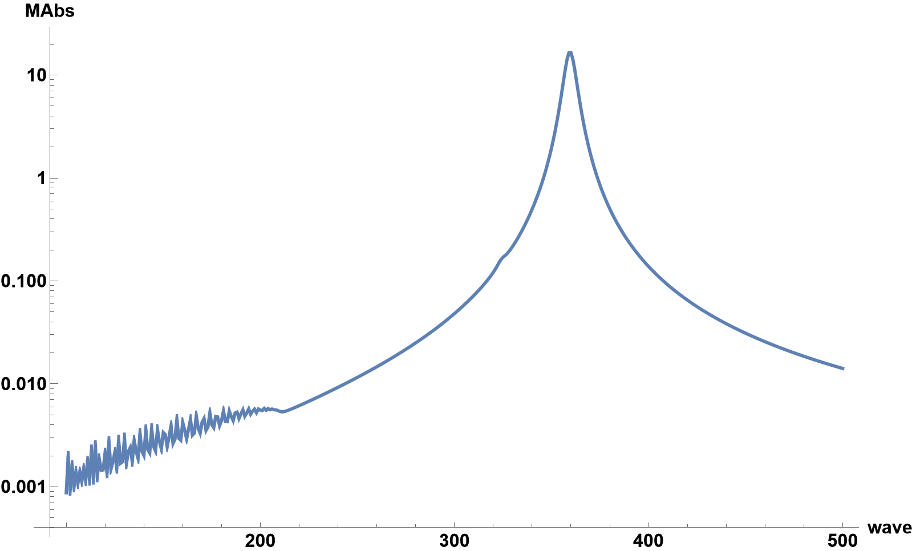
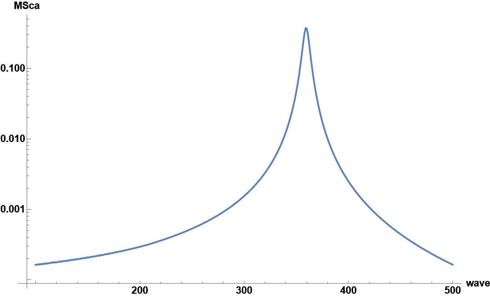

Wolfram Mathematica model for the calculation of efficiencies from metallic spheres for linearly polarized plane wave. 
Drude model (local response approximation) and Thomas-Fermi (non-local response approximation) models for the dielectric response are considered. The medium outside of the sphere is air with permittivity. 
The number of spherical harmonics is set to m = 25.
For Drude model the dielectric constant is set to (see [S.Maier](https://link.springer.com/book/10.1007/0-387-37825-1) eq. 1.27) and the Mie coefficients are calculated using expressions in [Bohren and Huffman](https://onlinelibrary.wiley.com/doi/book/10.1002/9783527618156) (see eqs. 4.56 and 4.57 on page 103). The efficiencies are evaluated using [Bohren and Huffman](https://onlinelibrary.wiley.com/doi/book/10.1002/9783527618156) eqs. 4.61 and 4.62.
For Thomas-Fermi model, I used the analytical model developed by [Th. Christensen et al.](https://pubs.acs.org/doi/10.1021/nn406153k)

The below results are evaluated for R = 5nm golden sphere, usng Thomas-Fermi model. The model is interactive and prompts for the imputs for the parameters.

